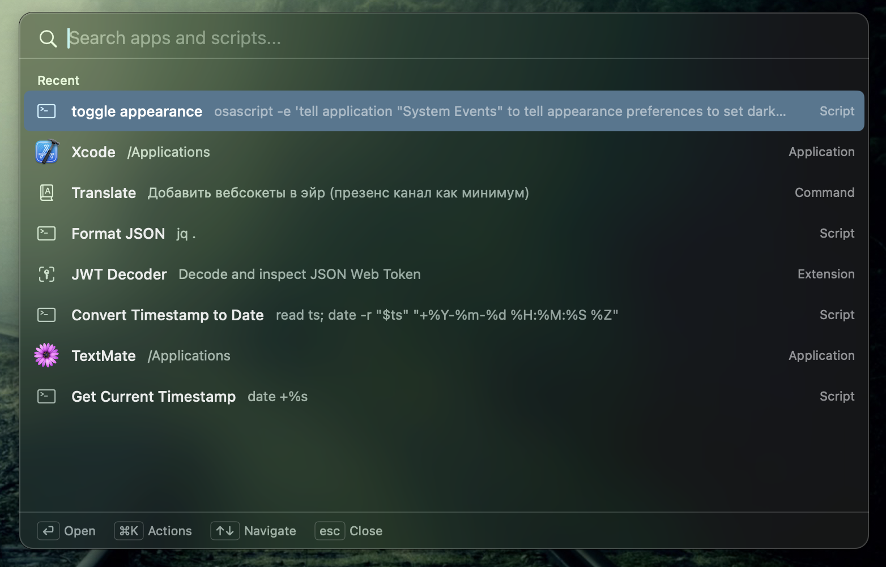
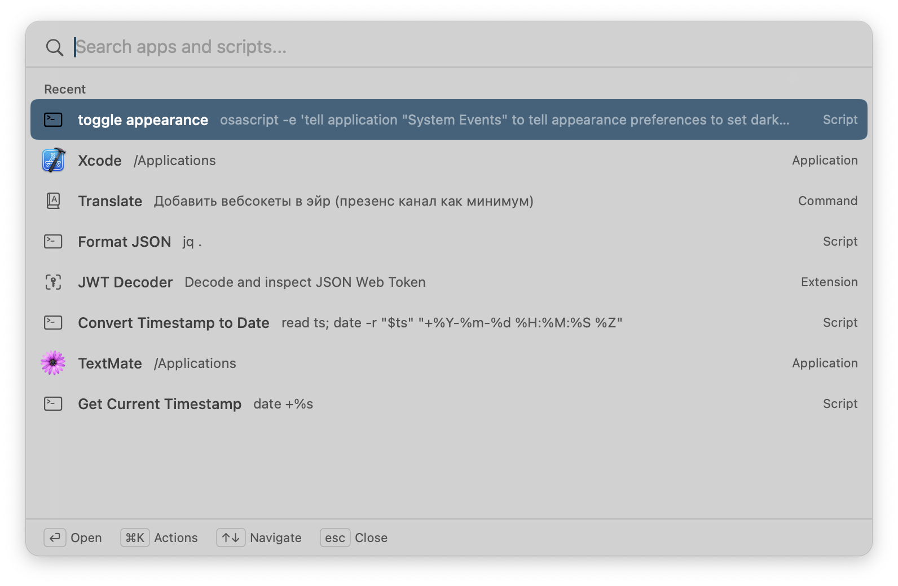
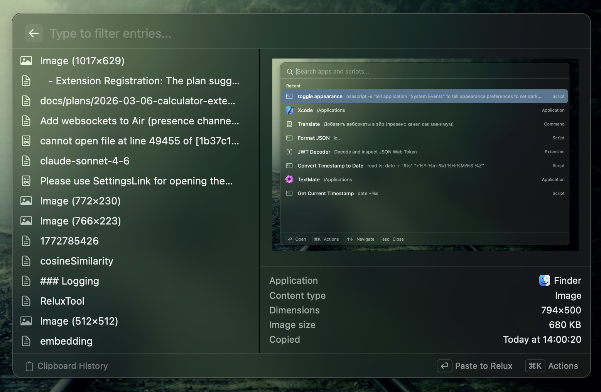
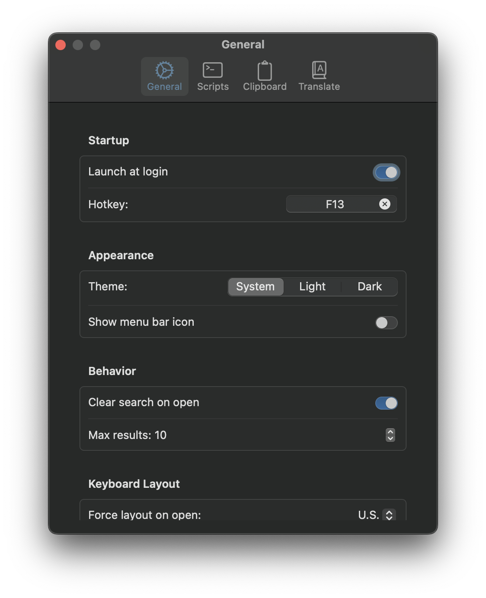

# Relux

A macOS menu-bar utility that puts app launching, clipboard history, translation, and more behind a single hotkey.

## Screenshots

<table>
  <tr>
    <td></td>
    <td></td>
  </tr>
  <tr>
    <td align="center"><em>Search overlay — dark</em></td>
    <td align="center"><em>Search overlay — light</em></td>
  </tr>
  <tr>
    <td></td>
    <td></td>
  </tr>
  <tr>
    <td align="center"><em>Clipboard history</em></td>
    <td align="center"><em>Settings</em></td>
  </tr>
</table>

## Features

- **App launcher** — fuzzy search across installed applications; search paths configurable in Settings
- **System Settings** — search and open macOS System Settings categories directly (Wi-Fi, Keyboard, Privacy, etc.)
- **Clipboard history** — searchable history, paste with `Cmd+Shift+V`
- **Translator** — select any text, trigger the overlay, pick Translate from quick links; streams translation via Anthropic API (requires API key in Settings)
- **Calculator** — inline math evaluation with currency conversion (rates fetched daily from ECB)
- **Web search** — fall through to DuckDuckGo
- **Custom scripts** — shell scripts that can read selected text and output back to the screen (or show a notification)

## Install

```bash
brew tap tectiv3/relux
brew install --cask relux
```

Or download the latest `.dmg` from [GitHub Releases](https://github.com/tectiv3/relux/releases). The app is signed and notarized by Apple.

## Requirements (building from source)

- macOS 14+
- Apple Silicon
- Xcode 16+
- [XcodeGen](https://github.com/yonaskolb/XcodeGen) (`brew install xcodegen`)

## Build & Run

```
xcodegen generate
open Relux.xcodeproj
```

Build and run from Xcode (⌘R).

## Usage

| Shortcut | Action |
|---|---|
| `Option+Space` | Open search overlay |
| `Cmd+Shift+V` | Open clipboard history |
| `Caps Lock` (on selection) | Quick links (translate, scripts, etc.) |
| `Esc` / click outside | Dismiss |

Keyboard shortcuts are configurable in Settings. On first launch Settings opens automatically.

> **Tip:** For the best experience, rebind the overlay shortcut to Caps Lock or another dedicated key so it's always one tap away.

## Architecture

```
Shell (menu bar, hotkey, overlay)
  → ExtensionProtocol
    → AppSearcher
    → SystemSettingsSearcher
    → ScriptSearcher
    → ClipboardStore (SQLite)
    → TranslateStore (SQLite)
```

Built around a generic extension protocol — the overlay is designed to be extended with new panel types.
